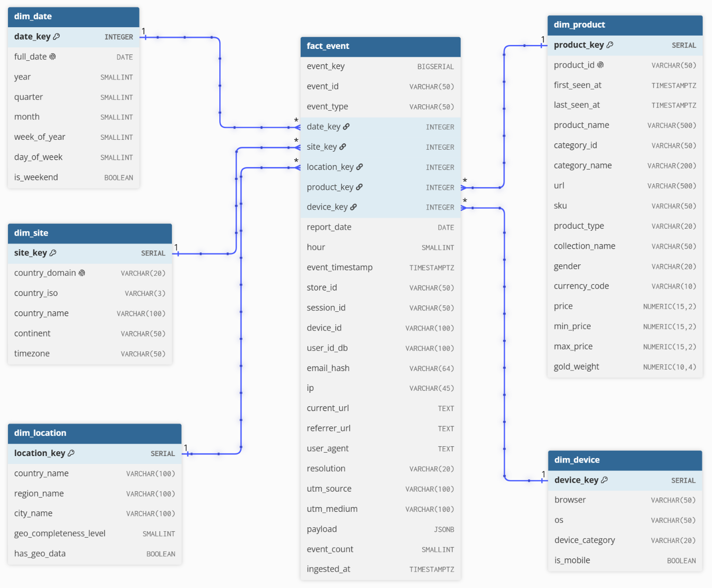

# Real-Time Clickstream Pipeline

Process e-commerce clickstream events from Kafka → Spark Structured Streaming → PostgreSQL star schema, with Airflow watching the whole path.

## Overview

An online jewelry storefront sells through per-country domains and emits a clickstream — product views, cart activity, checkout steps, site search, recommendation widgets. Raw, those events answer nothing: they arrive as one flat topic, carry a raw IP and user-agent instead of a place and a device, and name a product by id only.

This pipeline turns that stream into a warehouse the business can query within a minute of the event happening:

- **What sells attention** — most-viewed products, when they get looked at, which storefront locale views them.
- **Where visitors really are** — IP resolved to country/region/city, next to the storefront locale they landed on.
- **Which traffic works** — referrers and UTM source/medium, direct traffic counted as direct.
- **Where the funnel leaks** — product detail → cart → checkout, with `checkout_success` as the only conversion.
- **What they browse on** — browser, OS and mobile share through the day.

Reporting is plain SQL views on the star schema, so a changed question is one edited `SELECT` and no backfill.

## Architecture

```mermaid
%%{init: {"flowchart": {"nodeSpacing": 25, "rankSpacing": 45, "padding": 6, "curve": "basis"}}}%%
flowchart LR
    SRC@{ img: "docs/attachments/logo/kafka.png", label: "product_view<br/>source Kafka", pos: "b", h: 56, constraint: "on" }

    subgraph ING[ingestion]
        BR@{ img: "docs/attachments/logo/python.png", label: "bridge.py - validate", pos: "b", h: 56, constraint: "on" }
        SINK@{ img: "docs/attachments/logo/python.png", label: "mongo_sink.py", pos: "b", h: 56, constraint: "on" }
    end

    subgraph KL[Kafka local]
        KICON@{ img: "docs/attachments/logo/kafka.png", label: " ", pos: "b", h: 48, constraint: "on" }
        TOPIC[[user-events]]
        DLQ[[user-events-dlq]]
    end

    subgraph MDB[MongoDB]
        MICON@{ img: "docs/attachments/logo/mongodb.png", label: " ", pos: "b", h: 48, constraint: "on" }
        RAWC[(raw_events)]
    end

    subgraph SPK[Spark]
        SICON@{ img: "docs/attachments/logo/spark.png", label: " ", pos: "b", h: 48, constraint: "on" }
        STREAM[streaming DF<br/>parse - validate - enrich]
        BATCH[foreachBatch<br/>upsert dims - write fact]
    end

    subgraph PG[PostgreSQL]
        PICON@{ img: "docs/attachments/logo/postgresql.png", label: " ", pos: "b", h: 48, constraint: "on" }
        DIMS[(dim tables)]
        FACT[(fact_event)]
        VIEWS[/views/]
    end

    DASH@{ img: "docs/attachments/logo/streamlit.png", label: "Streamlit app", pos: "b", h: 56, constraint: "on" }
    AF@{ img: "docs/attachments/logo/airflow.png", label: "Airflow health DAGs", pos: "b", h: 56, constraint: "on" }

    SRC --> BR
	BR -- invalid --> DLQ
    BR -- valid --> TOPIC
    TOPIC --> SINK --> RAWC
    TOPIC -- readStream --> STREAM --> BATCH
    BATCH -- unknown event_type --> DLQ
    BATCH -- INSERT INTO --> DIMS & FACT
    DIMS & FACT --> VIEWS --> DASH
    AF -. observes .-> KL & SPK & PG

    KICON ~~~ TOPIC
    MICON ~~~ RAWC
    SICON ~~~ STREAM
    PICON ~~~ FACT

    classDef logo fill:none,stroke:none
    classDef kafka fill:none,stroke:#7048e8,color:#7048e8
    classDef mongo fill:none,stroke:#2f9e44,color:#2f9e44
    classDef spark fill:none,stroke:#f08c00,color:#f08c00
    classDef pg fill:none,stroke:#0c8599,color:#0c8599

    classDef kafkaBox fill:none,stroke:#7048e8,color:#7048e8,stroke-dasharray:6 4
    classDef appBox fill:none,stroke:#1971c2,color:#1971c2,stroke-dasharray:6 4
    classDef mongoBox fill:none,stroke:#2f9e44,color:#2f9e44,stroke-dasharray:6 4
    classDef sparkBox fill:none,stroke:#f08c00,color:#f08c00,stroke-dasharray:6 4
    classDef pgBox fill:none,stroke:#0c8599,color:#0c8599,stroke-dasharray:6 4

    class SRC,BR,SINK,DASH,AF,KICON,MICON,SICON,PICON logo
    class TOPIC,DLQ kafka
    class RAWC mongo
    class STREAM,BATCH spark
    class DIMS,FACT,VIEWS pg
    class KL kafkaBox
    class ING appBox
    class MDB mongoBox
    class SPK sparkBox
    class PG pgBox
```

### Technical stack

| **Layer**           | **Technology**             | **Purpose**                                            |
| ------------------------- | -------------------------------- | ------------------------------------------------------------ |
| **Event streaming** | Kafka (3 brokers, KRaft) + AKHQ  | Transports events; AKHQ for browsing topics and consumer lag |
| **Ingestion**       | Python + confluent-kafka         | Bridges the source cluster, validates, sinks to MongoDB      |
| **Raw storage**     | MongoDB                          | Keeps every accepted event as received                       |
| **Processing**      | PySpark (Structured Streaming)   | Parses, enriches and upserts into the star schema            |
| **Compute**         | Hadoop YARN (optional)           | Cluster mode for the Spark job;`local[*]` otherwise        |
| **Warehouse**       | PostgreSQL                       | `fact_event` + dimensions + reporting views                |
| **Visualization**   | Streamlit                        | Reports over the warehouse views                             |
| **Orchestration**   | Airflow 2.10                     | Health-monitoring DAGs with Discord alerting                 |
| **Infrastructure**  | Docker Compose, Makefile, Poetry | Local deployment and task automation                         |

### Applications

| App                    | What it does                                              | Details                                                 |
| ---------------------- | --------------------------------------------------------- | ------------------------------------------------------- |
| `apps/ingestion`     | source Kafka → validate → local Kafka → MongoDB        | [docs/ingestion-pipeline.md](docs/ingestion-pipeline.md) |
| `apps/processing`    | Kafka → Spark →`fact_event` + dims → views           | [docs/data-processing.md](docs/data-processing.md)       |
| `apps/orchestration` | Airflow DAGs watching Kafka, YARN/Spark and the warehouse | [docs/health-monitoring.md](docs/health-monitoring.md)   |
| `apps/dashboard`     | Streamlit reports over the warehouse                      | [docs/data-processing.md](docs/data-processing.md)       |

### Data model

One fact, five dimensions — [`docs/diagram/ecom_event_stream.dbml`](docs/diagram/ecom_event_stream.dbml) is the source of truth.



`fact_event` keeps the event grain (one row per event, event-family fields in a JSONB `payload`). `dim_product` and `dim_device` grow from the stream itself — upserted on first sight; `dim_date`, `dim_site` and `dim_location` are seeded or loaded offline.

## Quick start

Requires Docker, GNU Make, Python 3.12 and Poetry.

```bash
cp .env.example .env     # then fill in the credentials
poetry install
```

### Infrastructure

```bash
make up                  # Kafka + MongoDB + PostgreSQL + dashboard
make topics              # create topics with the right partition counts
make views               # create the reporting views
make ps / logs / psql / down
```

### Ingestion

```bash
poetry run python apps/ingestion/src/bridge.py       # source cluster → local Kafka
poetry run python apps/ingestion/src/mongo_sink.py   # local Kafka → MongoDB
```

### Processing

One job at a time — local and YARN mode keep separate checkpoints, and the lock enforces the rule.

```bash
make run-local                        # local[*]
make yarn-up && make run-yarn         # on YARN, client deploy-mode
make smoke-yarn                       # connectivity check only
```

### Orchestration

Two monitoring DAGs — `kafka_health_monitor` and `spark_health_monitor` — plus the shared operators, hooks and callbacks in the `dec` package under `apps/orchestration/`.

```bash
make airflow-build && make airflow-db && make airflow-init   # once
make airflow-up          # webserver + scheduler
make airflow-seed        # import connections + variables from apps/orchestration/config
```

Restart Airflow after editing `dec/` — libraries and plugins load once per process, while DAG files are re-parsed continuously.

### Tests

`make test` runs the ingestion and processing tests. The orchestration tests import `airflow`, so they run inside the image: `make airflow-test`.

### Services

| Service    | URL / Port                                      |
| ---------- | ----------------------------------------------- |
| AKHQ       | [http://localhost:8180](http://localhost:8180)   |
| Dashboard  | [http://localhost:8501](http://localhost:8501)   |
| Airflow    | [http://localhost:18080](http://localhost:18080) |
| Kafka      | `localhost:9094`, `9194`, `9294`          |
| MongoDB    | `localhost:27017`                             |
| PostgreSQL | `localhost:5432`                              |

## Project structure

```
ecom-event-stream/
├── apps/              # ingestion, processing, orchestration, dashboard
├── shared/            # config, connectors, schemas, utils
├── infrastructure/    # docker compose files + init scripts
├── scripts/           # one-off loaders and submit helpers
└── docs/              # pipeline, processing and monitoring docs
```
