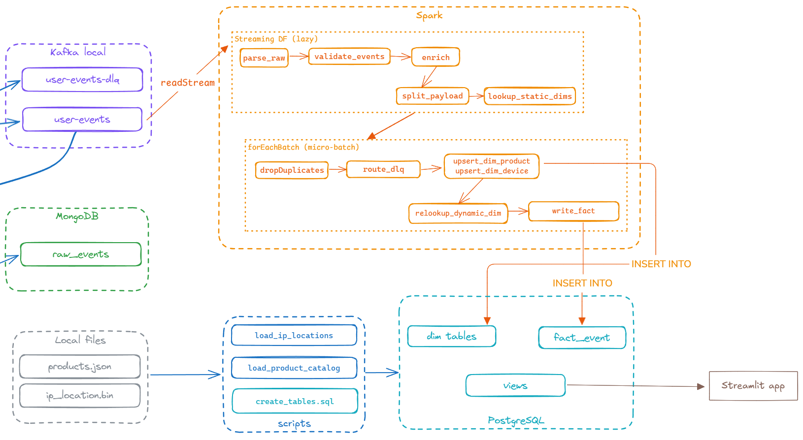
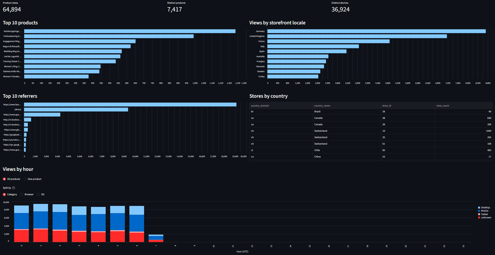

# Data Processing

Pipeline: local Kafka (`user-events`) → Spark Structured Streaming → PostgreSQL star schema (`fact_event` + dims) → SQL views → Streamlit dashboard.

## Data processing flow



The Spark job has two halves, and the split matters:

- **Streaming DF (lazy)** — `parse_raw` → `validate_events` → `enrich` → `split_payload` → `lookup_static_dims`. Declared once at start-up; nothing runs until `.start()`.
- **`foreachBatch` (micro-batch)** — inside it, the batch is an ordinary static DataFrame, so it can do things a streaming sink cannot: write to several destinations, and run SQL that Spark's JDBC writer has no clause for (`ON CONFLICT`).

Two dimensions are populated from the stream itself (`dim_product`, `dim_device`) — upserted on first sight, then re-read in the same batch so a value first seen now still gets its surrogate key now. The other dimensions are seeded once or loaded offline.

Trigger interval is 60 seconds. Checkpoint lives in `checkpoints/ecom-stream-processor` — **one job per checkpoint**, local and YARN mode keep separate ones and must not run at the same time.

---

## Results

**Live run**: events flow from `user-events` into `fact_event` within one trigger interval; `dim_product` and `dim_device` grow as new products and browser/OS combinations appear.


### Verifying the data

#### PostgreSQL — the warehouse

```bash
make psql
```

```sql
-- Rows landing, and event types beyond a single kind
SELECT COUNT(*), COUNT(DISTINCT event_type) FROM fact_event;

-- No duplicates: the writer is idempotent, so a replayed batch inserts nothing
SELECT event_id FROM fact_event GROUP BY 1 HAVING COUNT(*) > 1;   -- expect 0 rows

-- Surrogate keys resolved
SELECT COUNT(*) FILTER (WHERE product_key  IS NULL) AS no_product,
       COUNT(*) FILTER (WHERE device_key   IS NULL) AS no_device,
       COUNT(*) FILTER (WHERE location_key IS NULL) AS no_location
FROM fact_event;
```

`no_product` is expected to be large — most event types have no product. `no_device` should be 0. `no_location` grows until the IP loader is re-run.

#### Streamlit dashboard

[http://localhost:8501](http://localhost:8501) — starts with `make up`.

Three tabs: **One day** (the six reports, one date at a time), **Overview** (everything, no date filter), **Live** (auto-refreshes every 5s).

Examples:

- [Tab One day](./attachments/dashboard/OneDay.pdf)
- [Tab Overview](./attachments/dashboard/Overview.pdf)
- [Tab Live](./attachments/dashboard/Live.pdf)



#### Spark UI

[http://localhost:4040](http://localhost:4040) while the job runs — completed batches, failed tasks, input rate per trigger.


---

## How to run the program

`.env` must be filled in (source credentials + self-hosted Kafka / MongoDB / PostgreSQL credentials).

### Install

**1.** Start infrastructure (Kafka cluster + MongoDB + PostgreSQL + dashboard). PostgreSQL runs `create_tables.sql` and `create_views.sql` on first start, so the schema and views exist before the job connects:

```bash
make up
```

**2.** Create Kafka topics, then install deps and run the tests:

```bash
make topics
poetry install
make test
```

**3.** Load the two offline datasets. Neither comes from the stream, and skipping them leaves `location_key` NULL and `dim_product` without names or categories:

```bash
poetry run python scripts/load_ip_locations.py   --input data/IP-COUNTRY-REGION-CITY.BIN
poetry run python scripts/load_product_catalog.py --input data/product_*.json
```

Both are incremental and safe to re-run — they only touch what is missing.

### Run the streaming job

The ingestion pipeline must already be producing to `user-events`.

```bash
make run-local
```

`Ctrl+C` stops it. The checkpoint records how far it got, so restarting resumes from there without losing or double-counting events.

To run on the Hadoop/YARN cluster instead (first time needs `make yarn-up` and `make hdfs-init` once):

```bash
make run-yarn
```

Other useful targets: `make ps`, `make logs`, `make views` (recreate the reporting views), `make down`.
