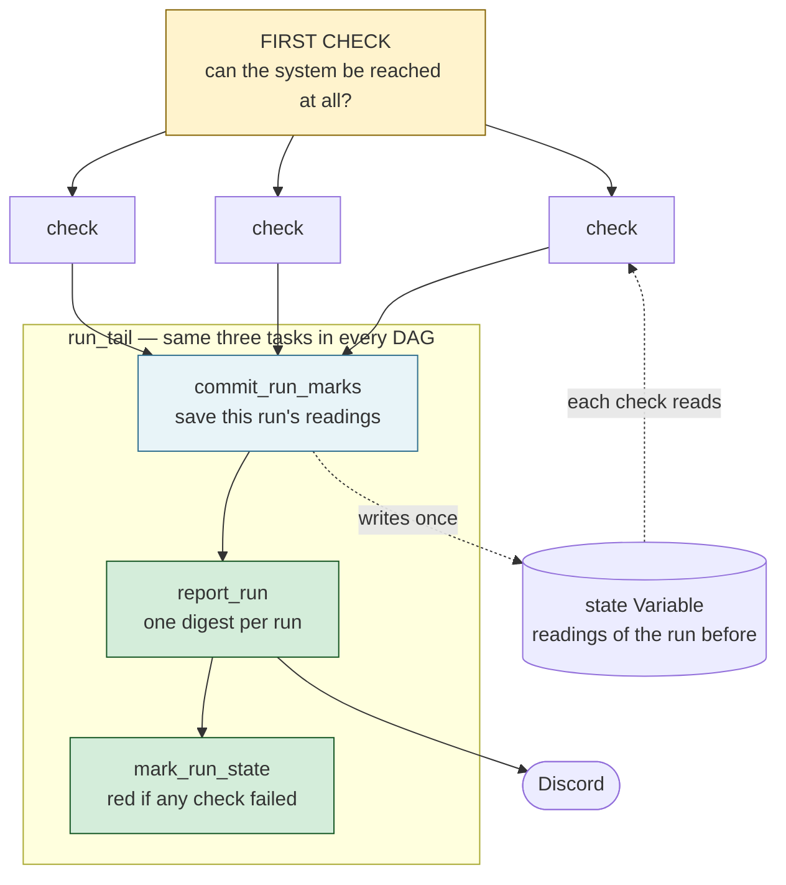
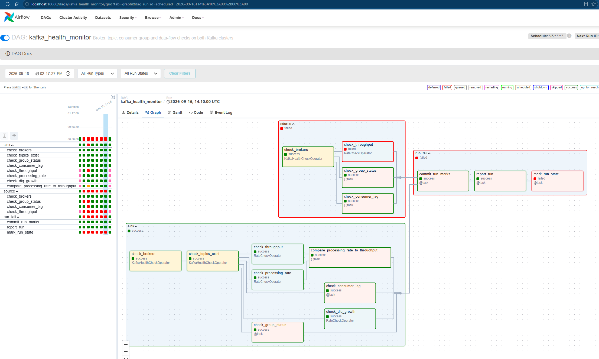
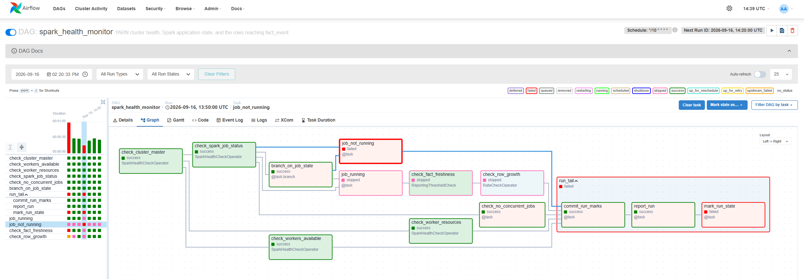
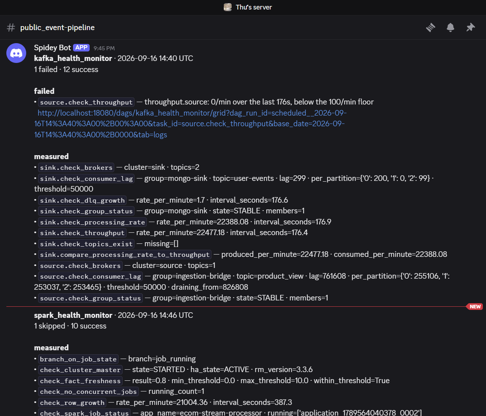
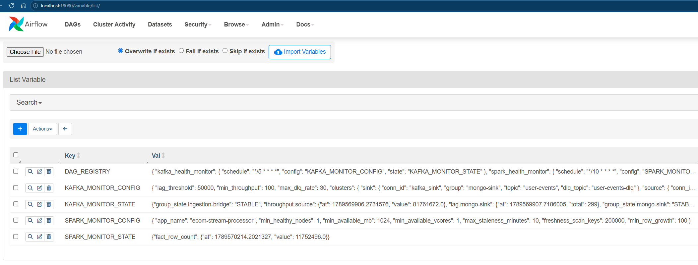

# Health Monitoring

Two Airflow DAGs watch the pipeline they do not run: `kafka_health_monitor` reads the Kafka clusters, `spark_health_monitor` reads YARN and the warehouse. Neither submits nor repairs anything — they measure, judge, and send one Discord digest per run.

## How a check works



Both DAGs have this shape, and every check in them has three parts:

| Part                | What it is                                                                                | Changes when                        |
| ------------------- | ----------------------------------------------------------------------------------------- | ----------------------------------- |
| **probe**     | one reading from the system (an offset, a node state, a row count…)                      | the external system changes its API |
| **judgement** | that reading against a threshold, held in an Airflow Variable                             | tune the threshold                  |
| **outcome**   | **pass**, **fail** (task goes red), or **skip** when it cannot conclude | —                                  |

- **The first check runs alone** — if the cluster cannot be reached, everything behind it fails.
- **The checks in the middle are silent and independent** — chaining them would hide one check's result behind another's failure.
- **The tail always runs** — marks save first, so a failed run still leaves the next one a baseline; `mark_run_state` is last, or `report_run` succeeding would leave every run green.

---

## `kafka_health_monitor`

Every 5 minutes, against both clusters — the upstream source and the self-hosted sink. The tight schedule is because retention is a real deadline: noticing late can mean data that no longer exists.

| Check                                          | Measures                              | Fails when                                                    | Softened / skipped when                                          |
| ---------------------------------------------- | ------------------------------------- | ------------------------------------------------------------- | ---------------------------------------------------------------- |
| `check_brokers`                              | topics listed in one round-trip       | the call still raises after 3 retries                         | a single failed round-trip — a rolling restart heals in seconds |
| `sink.check_topics_exist`                    | `user-events` + `user-events-dlq` | either is missing                                             | —                                                               |
| `check_group_status`                         | group state + member count            | not consuming, or*still* rebalancing one run later          | one run of`PREPARING_`/`COMPLETING_REBALANCING`              |
| `check_consumer_lag`                         | total lag across partitions           | over`lag_threshold` **and** no lower than last run    | lag is draining; partitions with no committed offset             |
| `check_throughput`                           | high-watermark growth, msg/min        | below`min_throughput`                                       | window too short or too long                                     |
| `sink.check_processing_rate`                 | committed-offset growth, msg/min      | never — a floor here would fire whenever the*source* stops | —                                                               |
| `sink.compare_processing_rate_to_throughput` | produced/min vs consumed/min          | messages are produced and the group commits nothing           | —                                                               |
| `sink.check_dlq_growth`                      | DLQ watermark growth, msg/min         | above`max_dlq_rate`                                         | —                                                               |

Only the connectivity checks retry (3 times, 30s apart). Measuring tasks run with `retries=0` — retrying a measurement measures something else.



One TaskGroup per cluster, each with its own first check: the clusters fail independently, so a dead sink must not stop the source checks. The comparison uses `NONE_FAILED`, so it still runs when a rate check skips — the run where it matters most.

---

## `spark_health_monitor`

Every 10 minutes. Structured Streaming keeps offsets in a checkpoint, not a consumer group, so there is no lag to read — latency only shows as rows arriving in `fact_event`. The DAG never submits a job; it says whether one is running and whether its output is landing.

| Check                        | Measures                                        | Fails when                                                  | Softened / skipped when                                         |
| ---------------------------- | ----------------------------------------------- | ----------------------------------------------------------- | --------------------------------------------------------------- |
| `check_cluster_master`     | ResourceManager`state` / `haState`          | not`STARTED`/`ACTIVE`                                   | —                                                              |
| `check_workers_available`  | NodeManagers RUNNING                            | fewer than`min_healthy_nodes`, or any node degraded       | —                                                              |
| `check_worker_resources`   | largest node's free MB and vcores               | no single node can host`min_available_mb`/`_vcores`     | a forecast, not an incident — a container must fit on one node |
| `check_spark_job_status`   | the applications under`app_name`              | never — it is the reading the branch splits on             | —                                                              |
| `job_not_running`          | which states the applications are parked in     | no RUNNING application (`ACCEPTED` counts as not running) | —                                                              |
| `check_no_concurrent_jobs` | how many are RUNNING at once                    | more than one — they corrupt each other's checkpoint       | —                                                              |
| `check_fact_freshness`     | minutes since the last`ingested_at`           | older than`max_staleness_minutes`                         | a snapshot — still passes for minutes after a hang             |
| `check_row_growth`         | `COUNT(*)` growth on `fact_event`, rows/min | below`min_row_growth`                                     | window over an hour — the mark predates a gap                  |

Freshness reads `ingested_at`, not the clock inside the event — that one runs behind and would measure the source instead of the job. These probes read an instant rather than a rate, so they keep one retry; `check_row_growth` does not.



Only one first check here: with the ResourceManager down, every later check fails for the same reason. The data checks hang off `job_running` rather than the branch, which would skip them on exactly the healthy runs worth checking.

> A job started with `make run-local` runs outside YARN — healthy, but invisible here, and it keeps failing `job_not_running`. Use `make run-yarn` for a job this DAG can see.

---

## Results

Every run ends with one Discord digest: state counts, each failure with its reason and a log link, then what the passing checks measured. Failures are never trimmed, measurements are, to stay inside Discord's 2000-character limit. The same text is in the `report_run` task log if the webhook is not configured.



### When a check goes red

The digest names the check, the reason and a link to its log — start there. What it usually means:

| Red check                                       | Usually                                                                  | Next                                                     |
| ----------------------------------------------- | ------------------------------------------------------------------------ | -------------------------------------------------------- |
| `check_brokers`                               | a broker is down, or credentials changed in`.env` without a re-seed    | `make ps`, then `make airflow-seed`                  |
| `sink.check_topics_exist`                     | the topics were never created                                            | `make topics`                                          |
| `check_group_status`                          | the consumer is not running —`mongo_sink.py` or `bridge.py` stopped | restart it ([ingestion](./ingestion-pipeline.md))         |
| `sink.check_consumer_lag`                     | `mongo-sink` is behind — this is the MongoDB consumer, not Spark      | AKHQ → consumer group; is lag lower next run?           |
| `check_throughput`                            | the source stopped producing — often not an incident by itself          | check the bridge before touching the sink                |
| `compare_processing_rate_to_throughput`       | events arriving, nothing committed — the consumer is wedged             | `mongo_sink.py` logs, and whether MongoDB is reachable |
| `sink.check_dlq_growth`                       | schema drift upstream — events are failing validation                   | read a few messages off`user-events-dlq` in AKHQ       |
| `check_cluster_master` / `check_workers_*`  | YARN is down or short of nodes                                           | `make yarn-up`, then the ResourceManager UI            |
| `job_not_running`                             | the job was started with`make run-local`, or YARN killed it            | `make run-yarn`; the YARN UI has the diagnostics       |
| `check_no_concurrent_jobs`                    | two jobs share one checkpoint — they will corrupt it                    | stop one now ([processing](./data-processing.md))         |
| `check_fact_freshness` / `check_row_growth` | the job is alive but not writing                                         | Spark UI: are batches still completing?                  |

A check that **skips** is not a failure — it could not conclude, usually because the previous mark is missing or the window was too short. That is expected on the first run after a seed, and on any manual run.

### Inspecting state

The marks a run left behind, as JSON:

```bash
make airflow-cli ARGS="variables get KAFKA_MONITOR_STATE"
make airflow-cli ARGS="variables get SPARK_MONITOR_STATE"
```

| Key                                         | Left by           | Holds                                                    |
| ------------------------------------------- | ----------------- | -------------------------------------------------------- |
| `group_state.<group>`                     | group status      | the state string, to catch a rebalance spanning two runs |
| `lag.<group>`                             | lag check         | `{at, total}`, to test whether lag is draining         |
| `throughput.sink` / `throughput.source` | throughput checks | `{at, value}` high watermark                           |
| `committed.sink`                          | processing rate   | `{at, value}` committed offsets                        |
| `dlq_watermark`                           | DLQ growth        | `{at, value}` DLQ high watermark                       |
| `fact_row_count`                          | row growth        | `{at, value}` `COUNT(*)` on `fact_event`           |

The same lives under **Admin → Variables**; a run's own numbers are on each task's **XCom** tab under the `measured` key, and the threshold it was judged against on its **Rendered Template** tab.



---

## How to run the program

`.env` must be filled in — connections (`kafka_sink`, `kafka_source`, `yarn_rm`, `postgres_warehouse`, `discord_alert`) are templated from it at seed time, so credentials never enter the repo.

### Install

**1.** Build the image and initialise Airflow (once):

```bash
make airflow-build && make airflow-db && make airflow-init
```

**2.** Start Airflow ([http://localhost:18080](http://localhost:18080)) and seed connections + variables:

```bash
make airflow-up
make airflow-seed
```

**3.** Unpause. Both DAGs are created paused, and return to paused after any deactivation — a run left `queued` with no scheduled runs behind it is usually this, not a dead scheduler:

```bash
make airflow-cli ARGS="dags unpause kafka_health_monitor"
make airflow-cli ARGS="dags unpause spark_health_monitor"
```

To force a run:

```bash
make airflow-cli ARGS="dags trigger kafka_health_monitor"
```

A manual run reads the marks but does not move them, so rate checks in it will often skip — a triggered run tests the wiring, it does not take a measurement.

### Configuration

Nothing is tuned in code. `DAG_REGISTRY` maps each `dag_id` to its schedule and its own two Variables:

| DAG                      | Schedule         | Config                   | State                   |
| ------------------------ | ---------------- | ------------------------ | ----------------------- |
| `kafka_health_monitor` | `*/5 * * * *`  | `KAFKA_MONITOR_CONFIG` | `KAFKA_MONITOR_STATE` |
| `spark_health_monitor` | `*/10 * * * *` | `SPARK_MONITOR_CONFIG` | `SPARK_MONITOR_STATE` |

| `KAFKA_MONITOR_CONFIG` | Default   | Meaning                                                                   |
| ------------------------ | --------- | ------------------------------------------------------------------------- |
| `lag_threshold`        | `50000` | where lag stops being ignorable and the direction test starts             |
| `min_throughput`       | `100`   | msg/min floor, set well under the observed rate so jitter is quiet        |
| `max_dlq_rate`         | `30`    | msg/min ceiling on rejects                                                |
| `clusters`             | 2 entries | `conn_id`, `group`, `topic`, `dlq_topic`, `timeout` per cluster |

| `SPARK_MONITOR_CONFIG`                        | Default                   | Meaning                                           |
| ----------------------------------------------- | ------------------------- | ------------------------------------------------- |
| `app_name`                                    | `ecom-stream-processor` | the YARN application name to look for             |
| `min_healthy_nodes`                           | `1`                     | NodeManagers that must be RUNNING                 |
| `min_available_mb` / `min_available_vcores` | `1024` / `1`          | the container one node must still be able to host |
| `max_staleness_minutes`                       | `10`                    | age limit on the newest`fact_event` row         |
| `min_row_growth`                              | `100`                   | rows/min floor                                    |

`lag_threshold` and `min_throughput` can also be set inside a `clusters` entry to override the DAG-wide value: the two clusters are different queues with different retention.

Edit `apps/orchestration/config/variables.json` and re-run `make airflow-seed`, or change the value under **Admin → Variables**. Thresholds are read per task instance, so a change applies on the next run with no restart; schedules and Variable *names* resolve at parse time instead.

### Tests

```bash
make airflow-test     # runs inside the Airflow image; `make test` skips these
```

Restart Airflow after editing anything under `dec/` — libraries and plugins load once per process, while DAG files are re-parsed continuously. A stale process reports an `ImportError` for code that is correct on disk, which reads exactly like a broken DAG.

Other useful targets: `make airflow-ps`, `make airflow-logs`, `make airflow-down`.
