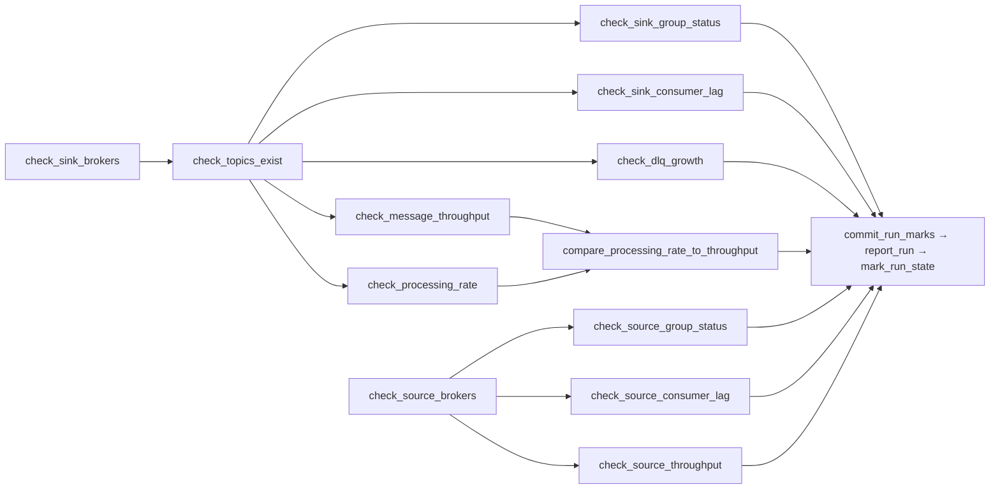
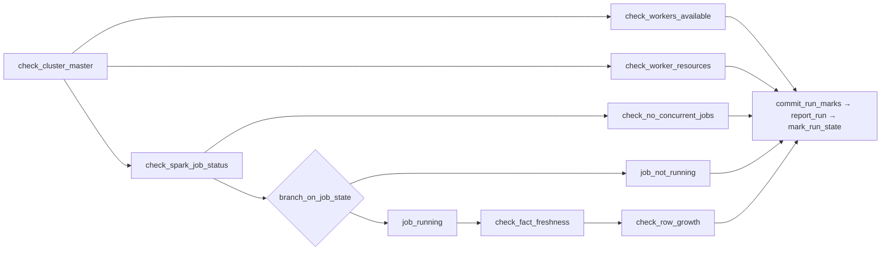

# Health Monitoring

Two Airflow DAGs watch the pipeline they do not run: `kafka_health_monitor` reads both Kafka clusters, `spark_health_monitor` reads YARN and the warehouse. Neither submits nor repairs anything — they measure, judge, and send one digest per run.

## How a check is built

Every check is a **probe** (one reading from the system), a **judgement** (that reading against a threshold held in an Airflow Variable, not in code), and an **outcome**.

Outcomes are three, not two. Alongside pass and **fail** there is **skip**, for when a check cannot conclude: a rate with no previous reading to compare against, a counter that moved backwards, a measuring window under 60s or over the ceiling. A few breaches are also softened to a log line, because a hard failure could never clear — a lag breach that is draining, a partition with no committed offset, a rebalance seen once.

Every DAG ends with the same three tasks:

```
all checks ──(ALL_DONE)──► commit_run_marks ──► report_run ──► mark_run_state
                           (save the marks)     (send digest)   (colour the run)
```

Marks save first, so a failed run still leaves the next one a baseline. `report_run` is the only task keeping a failure callback — an undeliverable digest must not be silent. `mark_run_state` fails the run if any check failed, which `report_run` succeeding would otherwise hide.

**Marks** are the previous reading of a measurement, in the DAG's own state Variable. Only a **scheduled** run commits them; a manual run reads the history without disturbing it.

---

## `kafka_health_monitor`

Every 5 minutes, against two independent clusters — the upstream source and the self-hosted sink. The tighter cadence is because retention is a real deadline: noticing late here can mean data that no longer exists.

### What it measures

| Check | Number measured | Scope | Hard-fails when | Softened or skipped when |
|---|---|---|---|---|
| `check_sink_brokers` / `check_source_brokers` | topics listed in one round-trip | source-system health | the call still raises after 3 retries, 30s apart | a single failed round-trip — a rolling broker restart heals in seconds |
| `check_topics_exist` | `user-events` and `user-events-dlq` present | configuration drift | either is missing | — |
| `check_sink_group_status` / `check_source_group_status` | consumer group state + member count | consumer liveness | the group is not consuming, or is *still* rebalancing one run later | one run of `PREPARING_`/`COMPLETING_REBALANCING` — logged only |
| `check_sink_consumer_lag` / `check_source_consumer_lag` | total lag across partitions | backlog, and the retention risk behind it | over `lag_threshold` **and** no lower than last run | over threshold but draining; partitions with no committed offset (lag there is unknown, not zero) |
| `check_message_throughput` / `check_source_throughput` | high-watermark growth, msg/min | traffic volume | below `min_throughput` | window too short or too long → skipped |
| `check_processing_rate` | committed-offset growth, msg/min | consumer progress | never — it has no floor of its own | — |
| `compare_processing_rate_to_throughput` | produced/min vs consumed/min | pipeline saturation | messages are being produced and the group commits nothing | — |
| `check_dlq_growth` | DLQ watermark growth, msg/min | data quality | above `max_dlq_rate` | — |

`check_processing_rate` has no floor of its own on purpose: one would fire whenever the *source* stops producing, turning one incident into two alerts. The comparison below it is the judgement.

Only the two connectivity checks retry (3 times, 30s apart); every measuring task runs with `retries=0`, because retrying a measurement measures something else.

### Graph



Two chains, two gates: the clusters fail independently, so a dead sink must not skip the source checks. The comparison uses `NONE_FAILED` so it still runs when a rate check skips — the run where it matters most.

---

## `spark_health_monitor`

Every 10 minutes. Spark Structured Streaming keeps offsets in a checkpoint rather than a consumer group, so there is no lag to read; its latency only shows as rows arriving in `fact_event`. The DAG never submits a job — it says whether one is running and whether its output is landing.

### What it measures

| Check | Number measured | Scope | Hard-fails when | Softened or skipped when |
|---|---|---|---|---|
| `check_cluster_master` | ResourceManager `state` / `haState` | cluster health | not `STARTED`/`ACTIVE` — nothing can be scheduled at all | — |
| `check_workers_available` | NodeManagers RUNNING vs `min_healthy_nodes` | cluster capacity | too few healthy nodes, or any node degraded | — |
| `check_worker_resources` | largest single node's free MB and vcores | capacity forecast | no one node can host a container of `min_available_mb`/`min_available_vcores` | a forecast, not an incident — judged per node, because a container has to fit on one |
| `check_spark_job_status` | the applications under `app_name` | job liveness | never — it is the reading the branch splits on | — |
| `job_not_running` | which states the applications are parked in | job liveness | no RUNNING application under that name (`ACCEPTED` counts as not running) | — |
| `check_no_concurrent_jobs` | how many are RUNNING at once | job liveness | more than one — they will corrupt each other's checkpoint | — |
| `check_fact_freshness` | minutes since the last `ingested_at` | data freshness | older than `max_staleness_minutes` | — |
| `check_row_growth` | `COUNT(*)` growth on `fact_event`, rows/min | data volume | below `min_row_growth` | window over an hour → skipped, the mark predates a gap |

Freshness reads `ingested_at`, not the clock inside the event — that one runs behind and would measure the source instead of the job. The two data checks answer different questions: freshness is a snapshot, so it still passes for minutes after the job hangs; only row growth, comparing against the previous run, catches a job that has stopped writing.

These probes read an instant rather than a rate, so they keep one retry; `check_row_growth` does not.

A job started with `make run-local` runs outside YARN: healthy, but invisible here, and it will keep failing `job_not_running`. Use `make run-yarn` for a job this DAG can see.

### Graph



One gate, not two: with the ResourceManager down every later check fails for the same reason. The data checks hang off `job_running` rather than the branch, which would skip them on exactly the healthy runs worth checking.

---

## Operating

### Configuration

Nothing is tuned in code. `DAG_REGISTRY` maps each `dag_id` to its schedule and to the names of its own two Variables:

| DAG | Schedule | Config | State |
|---|---|---|---|
| `kafka_health_monitor` | `*/5 * * * *` | `KAFKA_MONITOR_CONFIG` | `KAFKA_MONITOR_STATE` |
| `spark_health_monitor` | `*/10 * * * *` | `SPARK_MONITOR_CONFIG` | `SPARK_MONITOR_STATE` |

`KAFKA_MONITOR_CONFIG`:

| Key | Default | Meaning |
|---|---|---|
| `lag_threshold` | `50000` | where lag stops being ignorable and the direction test starts |
| `min_throughput` | `100` | msg/min floor, set well under the observed rate so jitter is quiet |
| `max_dlq_rate` | `30` | msg/min ceiling on rejects |
| `clusters` | 2 entries | `conn_id`, `group`, `topic`, `dlq_topic`, `timeout` per cluster |

`lag_threshold` and `min_throughput` can be set inside a `clusters` entry to override the DAG-wide value: the two clusters are different queues with different retention, so one number will not stay right for both.

`SPARK_MONITOR_CONFIG`:

| Key | Default | Meaning |
|---|---|---|
| `app_name` | `ecom-stream-processor` | the YARN application name to look for |
| `min_healthy_nodes` | `1` | NodeManagers that must be RUNNING |
| `min_available_mb` / `min_available_vcores` | `1024` / `1` | the container one node must still be able to host |
| `max_staleness_minutes` | `10` | age limit on the newest `fact_event` row |
| `min_row_growth` | `100` | rows/min floor |

Connections: `kafka_sink`, `kafka_source`, `yarn_rm`, `postgres_warehouse`, `discord_alert`.

Edit `apps/orchestration/config/variables.json` and re-seed, or change the value in the UI under **Admin → Variables** — thresholds are read per task instance, so a change applies on the next run with no restart:

```bash
make airflow-seed     # imports connections + variables, overwriting in place
```

Connections are templated from `.env` at seed time, so credentials never enter the repo. Schedules and Variable *names* resolve when the DAG is parsed, so those take effect once the scheduler re-reads the file.

### Running, and reading the report

```bash
make airflow-build && make airflow-db && make airflow-init   # once
make airflow-up                                              # http://localhost:18080
make airflow-seed
make airflow-cli ARGS="dags unpause kafka_health_monitor"
make airflow-cli ARGS="dags unpause spark_health_monitor"
```

Both DAGs are created paused, and return to paused after any deactivation — a run left `queued` with no scheduled runs behind it is usually this, not a dead scheduler.

Every run ends with one Discord digest: state counts, then each failure with its reason and a link to its log, then what the passing checks measured. Failures are never trimmed, measurements are, to stay inside Discord's 2000-character limit. The same text is in the `report_run` task log if the webhook is not configured.

To force a run:

```bash
make airflow-cli ARGS="dags trigger kafka_health_monitor"
```

A manual run reads the marks but does not move them, so rate checks in it will often skip. That is deliberate: a triggered run tests the wiring, it does not take a measurement.

### Inspecting state

The marks a run left behind, as JSON:

```bash
make airflow-cli ARGS="variables get KAFKA_MONITOR_STATE"
make airflow-cli ARGS="variables get SPARK_MONITOR_STATE"
```

| Key | Left by | Holds |
|---|---|---|
| `group_state.<group>` | group status | the state string, to catch a rebalance spanning two runs |
| `lag.<group>` | lag check | `{at, total}`, to test whether lag is draining |
| `throughput.sink` / `throughput.source` | throughput checks | `{at, value}` high watermark |
| `committed.sink` | processing rate | `{at, value}` committed offsets |
| `dlq_watermark` | DLQ growth | `{at, value}` DLQ high watermark |
| `fact_row_count` | row growth | `{at, value}` `COUNT(*)` on `fact_event` |

In the UI the same lives under **Admin → Variables**. A run's own numbers are on each task's **XCom** tab under the `measured` key.

The thresholds an operator tunes most — `lag_threshold`, `min_throughput`, `max_dlq_rate`, `max_staleness_minutes`, `min_row_growth` — reach their task as Jinja, so the value a run was judged against is on its **Rendered Template** tab. The YARN capacity thresholds are read inside the probe instead and appear in the task log, not that tab.

### Tests

```bash
make airflow-test     # runs inside the Airflow image; `make test` skips these
```

Restart Airflow after editing anything under `dec/` — libraries and plugins load once per process, while DAG files are re-parsed continuously. A stale process reports an `ImportError` for code that is correct on disk, which reads exactly like a broken DAG.
