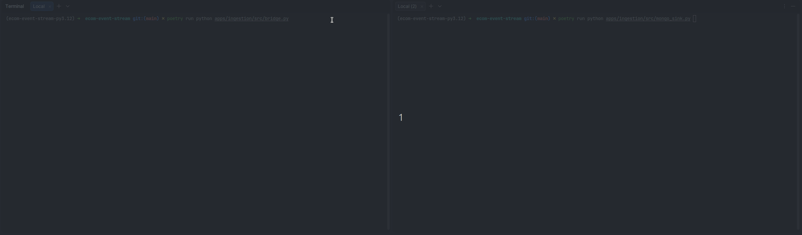

# Kafka Ingestion

Pipeline: external source Kafka (`product_view`) → validate → local Kafka (`user-events` / `user-events-dlq`) → MongoDB (`raw_events`).

## Data flow


---

## Results

**Live run**:

- Bridge consumes events from the source cluster
- Mongo sink consumes events from the local cluster & flows into MongoDB




### Verifying the data

#### AKHQ - browse Kafka

AKHQ UI: [http://localhost:8180](http://localhost:8180).
Use it to inspect messages on `user-events` / `user-events-dlq`, and check consumer group `mongo-sink` (offsets, lag).


#### MongoDB - `raw_events`

- Credentials: `infrastructure/docker/db.env`.


---

## How to run the program

`.env` must be filled in (source credentials + self-hosted sink/MongoDB credentials).

### Install

**0.** Symlink `.env` next to the compose files. Required for `${VAR}` interpolation (`CLUSTER_ID`, `MONGO_INITDB_ROOT_*`, AKHQ secrets)
- without it, brokers fail to start and Mongo initializes with no root user:

```bash
ln -s ../../.env infrastructure/docker/.env
```

**1.** Start infrastructure (Kafka cluster + MongoDB):

```bash
docker compose -f infrastructure/docker/docker-compose.kafka.yml \
               -f infrastructure/docker/docker-compose.db.yml up -d
```

**2.** Create Kafka topics with correct partition counts. Must run before any producer/consumer triggers auto-create, otherwise `user-events-dlq` would get 3 partitions instead of 1:

```bash
docker exec -i kafka-0 bash < infrastructure/docker/kafka/create_topics.sh
```

**3.** Install deps & run unit tests:

```bash
poetry install
poetry run pytest apps/ingestion/ -v
```

### Run ingestion (2 terminals)

```bash
# product_view -> user-events / dlq
poetry run python apps/ingestion/src/bridge.py

# user-events -> MongoDB
poetry run python apps/ingestion/src/mongo_sink.py
```

`Ctrl+C` on terminal triggers graceful shutdown - last offset is committed before exit.
