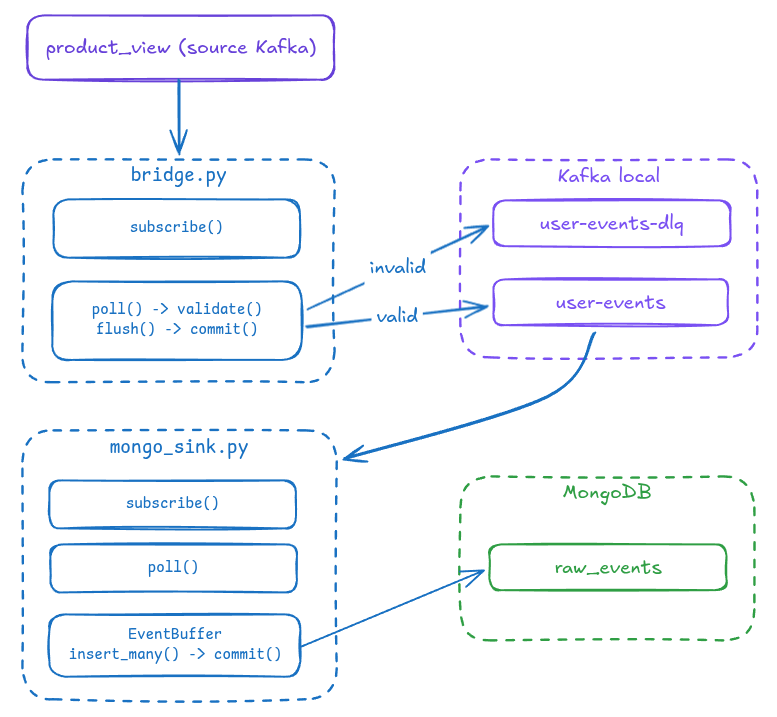
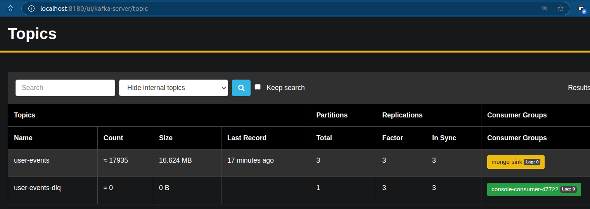
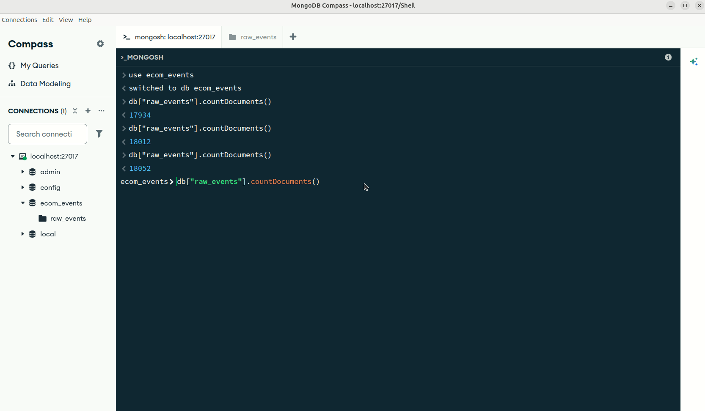

# Kafka Ingestion

Pipeline: external source Kafka (`product_view`) → validate → local Kafka (`user-events` / `user-events-dlq`) → MongoDB (`raw_events`).

## Data flow 


---

## Results

**Live run**:
- Bridge consumes events from the source cluster
- Mongo sink consumes events from the local cluster & flows into MongoDB


---

### Verifying the data

#### AKHQ - browse Kafka

AKHQ UI: [http://localhost:8180](http://localhost:8180).
Use it to inspect messages on `user-events` / `user-events-dlq`, and check consumer group `mongo-sink` (offsets, lag).




#### MongoDB - `raw_events`

- Credentials: `infrastructure/docker/db.env`.




---

## How to run the program

`.env` must be filled in (source credentials + self-hosted sink/MongoDB credentials).

### Install
```bash
# 1. Start infrastructure (Kafka cluster + MongoDB)
docker compose -f infrastructure/docker/docker-compose.kafka.yml \
               -f infrastructure/docker/docker-compose.db.yml up -d

# 2. Install deps & run unit tests
poetry install
poetry run pytest apps/ingestion/ -v
```

### Run ingestion (2 terminals)
```bash
# product_view -> user-events / dlq
poetry run python apps/ingestion/src/bridge.py

# user-events -> MongoDB
poetry run python apps/ingestion/src/mongo_sink.py
```

`Ctrl+C` on terminal triggers graceful shutdown - last offset is committed before exit.
