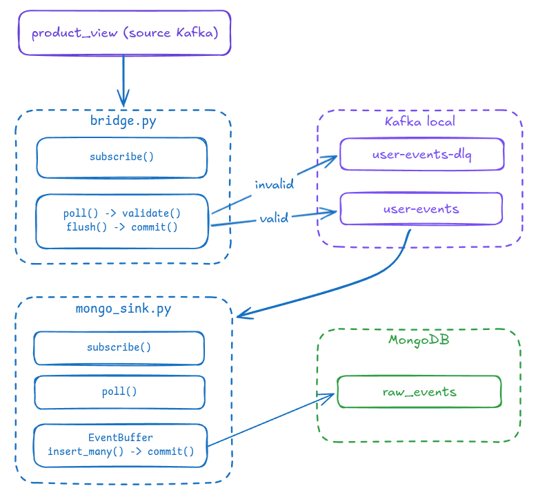
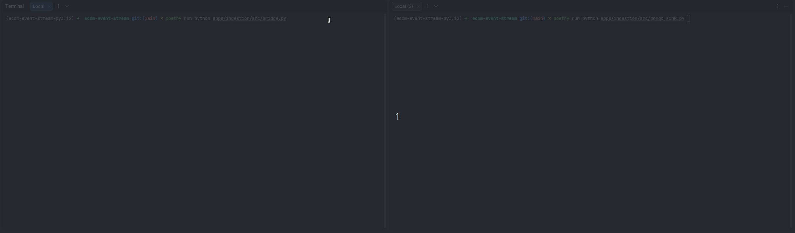
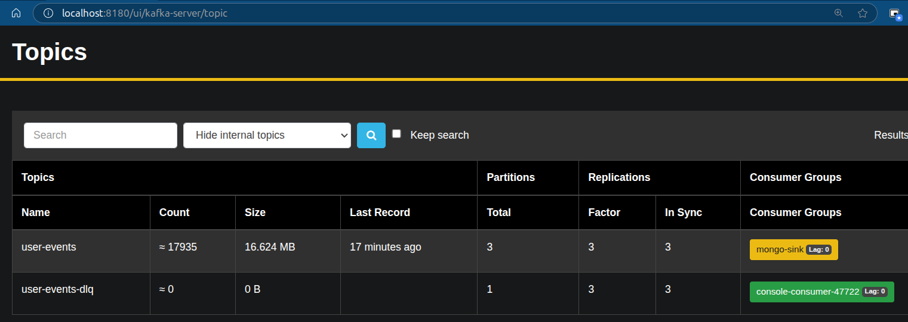
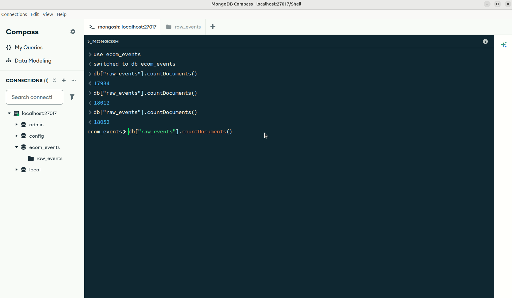

# Kafka Ingestion

Pipeline: external source Kafka (`product_view`) → validate → local Kafka (`user-events` / `user-events-dlq`) → MongoDB (`raw_events`).

## Data flow



---

## Results

**Live run**:

- Bridge consumes events from the source cluster
- Mongo sink consumes events from the local cluster & flows into MongoDB




### Verifying the data

#### AKHQ - browse Kafka

AKHQ UI: [http://localhost:8180](http://localhost:8180).
Use it to inspect messages on `user-events` / `user-events-dlq`, and check consumer group `mongo-sink` (offsets, lag).



#### MongoDB - `raw_events`

- Credentials: `.env` (`MONGO_USER` / `MONGO_PASSWORD`).



---

## How to run the program

`.env` must be filled in (source credentials + self-hosted sink/MongoDB credentials).

### Install

**1.** Start infrastructure (Kafka cluster + MongoDB). Run from the repo root, so `.env` (`CLUSTER_ID`, `MONGO_INITDB_ROOT_*`, AKHQ secrets) is picked up via `--env-file`:

```bash
make up
```

**2.** Create Kafka topics with correct partition counts. Must run before any producer/consumer triggers auto-create, otherwise `user-events-dlq` would get 3 partitions instead of 1:

```bash
make topics
```

**3.** Install deps & run unit tests:

```bash
poetry install
make test
```

Other useful targets: `make ps` (container status), `make logs` (tail logs), `make down` (stop infrastructure).

### Run ingestion (2 terminals)

```bash
# product_view -> user-events / dlq
poetry run python apps/ingestion/src/bridge.py

# user-events -> MongoDB
poetry run python apps/ingestion/src/mongo_sink.py
```

`Ctrl+C` on terminal triggers graceful shutdown - last offset is committed before exit.
